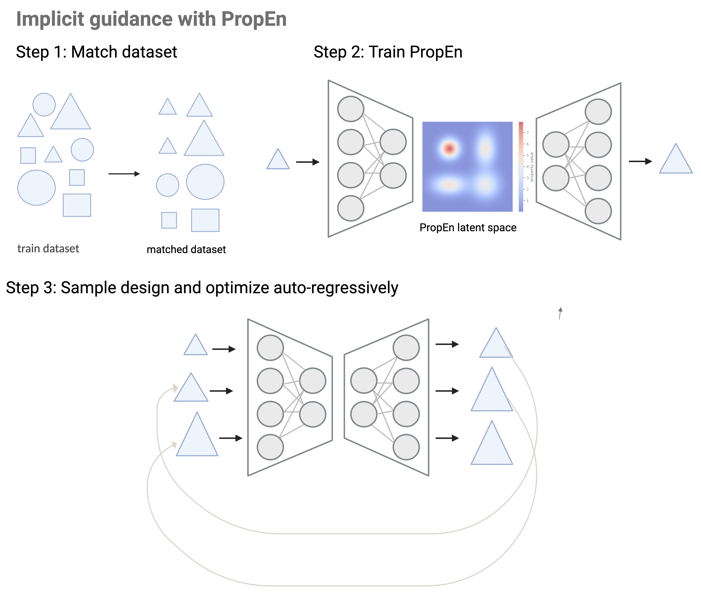

# Property Enhancer (PropEn)

This is the official repository for [PropEn](https://openreview.net/pdf?id=dhFHO90INk), developed by [ntagas](https://tagas.github.io/aboutme/) from [Prescient Design, a Genentech accelerator](https://gene.com/prescient).

<div align="center">

</div>

PropEn is a general method that combines generation and optimization into a single model. Suppose you have a dataset of objects \( x \) with labels \( y \) that measure a certain property (for example, the surface area of an object). Your goal is to increase (or otherwise improve) this property for a given input.

PropEn accomplishes this through implicit design optimization. Its approach involves three main steps:

1. **Matching the Training Dataset:**  
   Pair each example \( x \) with another example \( x' \) whose label \( y' \) is larger (or improved) compared to \( y \). This creates a direction in the data that points toward improved properties.

2. **Training an Encoder-Decoder Model:**  
   Train a model on these paired examples to learn transformations from \( x \) to \( x' \).

3. **Enhancing Examples:**  
   Once trained, you can pass new inputs through the model to produce outputs with enhanced properties.

This training paradigm is domain-agnostic and can be applied to various fields, such as:

- **Molecular Design:** Optimizing sequences or structures to improve therapeutic properties.
- **Finance:** Optimizing a portfolio of stocks to reduce risk or increase returns.
- **Engineering:** Shape optimization for improved aerodynamic or structural properties.

This repository provides demo code that you can adapt to your own applications. If you are interested in using PropEn for molecular design, engineering, or other use cases as shown in our manuscript, feel free to contact [natasa.tagasovska@roche.com](mailto:natasa.tagasovska@roche.com).

## Setup

Assuming you have [miniconda](https://docs.conda.io/en/latest/miniconda.html) or another conda-based Python environment, clone the repository, navigate to the directory, and install the dependencies:

```bash
pip install -r requirements.in
```

## Running the Demo
The entry point run_propen_demo is a wrapper that handles dataset matching, training, and sampling for a toy dataset. To use different datasets, modify the utilities in the utils directory; to adjust the model architecture or training procedures, see the propen directory.

A complete end-to-end example, including results, is provided in the demo notebook. Open it in a Jupyter environment to see how PropEn works on a toy problem.

## Contributing
We welcome contributions! If you would like to submit a pull request, please base it off the latest main branch. For significant changes, consider opening an issue first to discuss your proposal.

## License
This software is licensed under a modified Apache License, Version 2.0 (the "License"), specifically a Genentech Non-Commercial Software License. You may not use these files except in compliance with the License. You may obtain a copy of the License.

Unless required by applicable law or agreed upon in writing, software distributed under the License is provided on an "AS IS" BASIS, WITHOUT WARRANTIES OR CONDITIONS OF ANY KIND, either express or implied. See the License for the specific language governing permissions and limitations under the License.

## Citation
If you use this code and/or model, please cite:
```
@article{tagasovska2024implicitly,
  title={Implicitly Guided Design with PropEn: Match your Data to Follow the Gradient},
  author={Tagasovska, Nata{\v{s}}a and Gligorijevi{\'c}, Vladimir and Cho, Kyunghyun and Loukas, Andreas},
  journal={NeurIPS},
  year={2024}
}
```
